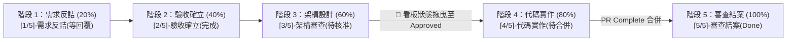

# 🚀 企業級 AI SDLC 自動化調度平台 (AI SDLC Platform)

本倉庫為獨立的 **AI 軟體交付生命週期 (AI SDLC) 核心調度引擎**。  
與業務微服務應用程式庫（Application Repos）完全解耦，以**「內部開發者平台 (IDP)」**模式運作，統一為企業多個專案提供全自動 Scrum 推進。

---

## 🏗️ 核心架構與五階段階梯狀態機



---

## 📦 目錄結構

```text
ai-sdlc-platform/
├── scripts/
│   ├── ado-client.js        # Azure DevOps REST API 統一客戶端 (支援 409 自動重試)
│   └── sdlc.js              # 核心狀態機調度大腦與定時巡邏引擎 (Poll Engine)
├── .skills/
│   └── spec-coder/          # Java Spring Boot 3 企業架構代碼生成規範手冊
├── .azure-pipelines/        # Azure Pipelines 定時排程 YAML
├── .gitlab-ci.yml           # GitLab CI 定時排程 YAML
├── ado-sdlc.config.json     # 全域專案資訊與 Scrum 標籤設定檔
└── package.json             # 模組設定檔
```

---

## ⚡ 使用方式 (CLI 指令)

```bash
# 1. 定時巡邏掃描所有活躍需求並自動推進
node scripts/sdlc.js poll

# 2. 指定外部業務程式庫目錄 (Multi-Repo 模式)
node scripts/sdlc.js poll --target-dir=/path/to/business-repo

# 3. 建立示範用 PBI
node scripts/sdlc.js create-pbi "需求標題" "業務描述"

# 4. 手動指定 PBI 推進單一階段
node scripts/sdlc.js intend <pbi-id>
node scripts/sdlc.js confirm-intend <pbi-id>
node scripts/sdlc.js design <pbi-id>
node scripts/sdlc.js implement <pbi-id>
```

---

## 🔒 企業資安與最佳實踐
1. **無 Webhook 限制**：採每 10 分鐘 Scheduled Polling 機制，資安友善。
2. **架構安全防線 (State Gate)**：Wiki 規格書產出後卡在 `[3/5]` 階段，必須由架構師於看板將卡片拖曳至 **Approved** 才會啟動代碼實作。
3. **單一開關標籤**：僅識別 **`ai-candidate`** 標籤，不誤傷團隊其他人工作業。
